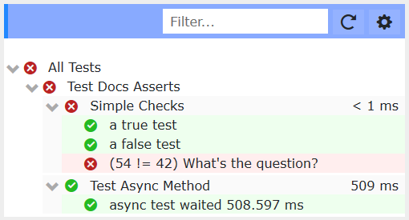
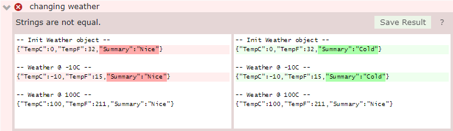
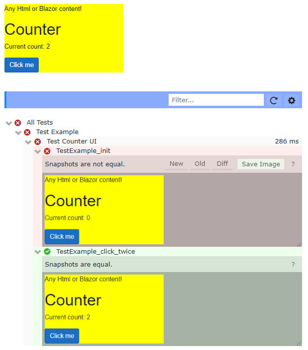

# IcuBlazor

IcuBlazor is a unit testing framework designed to fit naturally within the Blazor ecosystem. It offers modern testing strategies such as text & pixel diffs, UI automation and more.


### What's in the box?
- Modern testing API
	- [Easily define unit tests with Blazor syntax](#usage)
    - [Text & Log diff testing](#diff-testing)
    - [Image capture & pixel diff comparison](#ui-testing)
    - [Direct & Indirect UI Automation](#ui-testing) 
- A complete test runner
    - [Embed runner in Blazor pages](#usage)
    - [Supports both Client-Side & Server-Side Blazor apps](docs/config.md)
    - Debug code while testing
    <!-- - zzz Command Line support? -->

## Usage
After [configuring your app](docs/config.md) you can create a test suite.  A suite is just a blazor component that inherits `IcuTestSuite`.  Suites contain unit tests which are just methods with a `Checker` argument.  Here is a suite defined in *TestExample.razor*.
 
```cs {highlight="2,5,11"}
@page "/MyTests/TestExample"
@inherits IcuBlazor.IcuTestSuite
							
@code {
    public void SimpleChecks(Checker check)
    {
        check.True(2 < 3, "a true test");
        check.False(2 == 3, "a false test");
        check.Equal(6*9, 42, "What's the question?");
    }
    async Task Test_async_method(Checker check)
    {
        var t0 = DateTime.Now;
        await Task.Delay(500);
        var dt = (DateTime.Now - t0).TotalMilliseconds;

        // Surprise! Sometimes dt<500 :o
        check.True(500 < dt && dt < 550, $"async test waited {dt} ms");
    }
}
```

Place this suite within an `<IcuTestViewer>` to execute and view the test results. In */MyTests/AllTests.razor*:
```html
<IcuTestViewer Width="1000">
    <TestExample />
</IcuTestViewer>
``` 

When rendered, it should look something like this:



## Diff Testing 

You can use `Checker.Text(expect, result, ...)` and `Checker.Log(logName, result, ...)` to check long strings. If `expect` differs from `result` IcuBlazor presents a diff dialog.  If you click save, the result is saved in a file, `{logName}.txt`, and is used as the expected value the next time the test is run.



The above was generated with the code below.  Note how the test detected a change in "Summary" but there was no explicit code for that field.  Consider what a traditional unit test would look like :frowning:.  How would that test change if Summary changed :fearful:?  Finally, consider how you would refactor the following code :smile:.

<!-- To a great extent **we have decoupled the test from the app!**  Traditional unit tests would require you to change your test code if you changed the app behavor.  With `Check.Log()` all you have to do is click `Save Result`. 

So changing your app code doesn't require changing your test code.
-->


```cs {highlight="3,6,16"}
void Test_text_diff(Checker check)
{
    var w = new MyWeatherForecast();  // Object Under Test (OUT?)
    var sb = new StringBuilder();
    sb.AppendLine($"-- Init Weather object --");
    sb.AppendLine(Conv.ToJson(w));

    w.TempC = -10;
    sb.AppendLine($"\n-- Weather @ {w.TempC}C --");
    sb.AppendLine(Conv.ToJson(w));

    w.TempC = 100;
    sb.AppendLine($"\n-- Weather @ {w.TempC}C --");
    sb.AppendLine(Conv.ToJson(w));

    check.Log("weather", sb.ToString(), "changing weather");
}
```

## UI Testing 

UI testing and automation is also very easy. Here's a test suite that checks our venerable `<Counter/>` component.

```cs {highlight="4-7,14-20"}
@page "/TestExample"
@inherits IcuBlazor.IcuTestSuite

<IcuTestDiv Suite="@this" Width="300" style="background:yellow;">
    <p>Any Html or Blazor content!</p>
    <Counter @ref="myCounter"/> 
</IcuTestDiv>

@code {
    Counter myCounter;

    public async Task Test_Counter_UI(Checker cx)
    {
        await CompareDiv(cx, "init");

        var button = await UI.Find("button", "Click me");
        await UI.Click(button);
        await UI.Click(button);
        await CompareDiv(cx, "click_twice");
        cx.True(myCounter.currentCount==2, "Directly test component!");
    }
}
```

`<IcuTestDiv>` is basically a `<div>` that defines a test area where you can place your UI component(s).  Here we have styled the div yellow just to discern it's bounds. With the `UI` automation api we locate the button and click it...twice!  [See more automation methods.](docs/api.md)

`CompareDiv(Checker, image_file)` is the "Assert" operation of UI testing.  It takes a snapshot of the div and compares it **_pixel-by-pixel_** with a previous snapshot (defined by `{image_file}.png`).  IcuBlazor presents an image diff dialog if the images differ.

Optionally, you can use Blazor's `@ref` attribute get the component object. Now you can set or get state (e.g. `myCounter.currentCount`) or even invoke methods (e.g. `myCounter.ClickButton()`).

A run of this test may look like this:



Note how the counter snapshots start at 0 and end with 2, proving that the automation worked!  

Additionally, the test component is still at the top of the page--live and clickable. This is very useful for Test Driven Development. You can continue debugging and interacting with the component even after the tests finish.

**Note:  The current image capture technique is experimental.**  While it works solidly in our test environment we have not tested it everywhere.  (Please let us know if you have any issues.)  `CompareDiv()` assumes the div is not occluded when a snapshot is created. And while the main browsers (Chrome, Firefox, Edge) are supported, there are _still_ browser differences that you may need to account for.

## Support
If you discover a bug or have a feature request feel free to open an issue.

